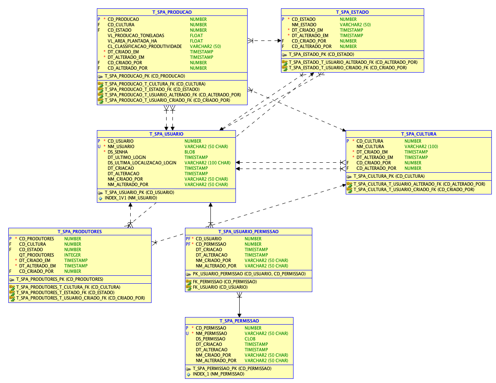

# FIAP - Faculdade de Informática e Administração Paulista

<p align="center">
<a href= "https://www.fiap.com.br/"></a>
</p>

<br>

### Cap-10-Explorando-SQL-e-tipos-de-dado-na-Oracle

# Grupo 20


## 👨‍🎓 Integrantes: 
- <a href="https://www.linkedin.com/in/caiorcastro/">Caio Rodrigues Castro</a> 
- <a href="https://www.linkedin.com/in/ederson-badeca/">Ederson Luiz Badeca dos Santos</a> 
- <a href="https://www.linkedin.com/in/digitalmanagerfelipesoares/">Felipe Soares Nascimento</a>
- <a href="https://www.linkedin.com/in/lfhillesheim/">Lucas Ferreira Hillesheim</a>

## 👩‍🏫 Professores:
### Tutor(a) 
- <a href="https://www.linkedin.com/in/lucas-gomes-moreira-15a8452a/">Lucas Gomes</a>
### Coordenador(a)
- <a href="https://www.linkedin.com/in/profandregodoi/">André Godoi Chiovato</a>

## 📜 Descrição
O **Sistema de Produção Agrícola (SPA)** é um projeto de modelagem de dados desenvolvido para armazenar e analisar informações relacionadas à produção agrícola no Brasil. O projeto foi projetado para oferecer uma estrutura eficiente, normalizada e integrada, utilizando dados de fontes oficiais como **CONAB**, **IBGE**, **MAPA**, **Embrapa**, e outras instituições relevantes no setor agrícola. Este repositório contém a modelagem lógica e física do banco de dados, além do código SQL necessário para a criação das tabelas e inserção de dados.

## Objetivos

O objetivo principal deste projeto é implementar um banco de dados relacional que seja capaz de:
- Armazenar informações detalhadas sobre a produção agrícola por estado e tipo de cultura.
- Garantir a integridade e a normalização dos dados, aplicando as **1ª, 2ª** e **3ª Formas Normais** (1FN, 2FN, 3FN).
- Facilitar consultas analíticas para identificar a produção total, área plantada, e a classificação de produtividade em diferentes estados e culturas.

### Diagrama de Entidade-Relacionamento (DER)

O diagrama de entidade-relacionamento (DER) do SPA foi desenvolvido para identificar as entidades principais do sistema, seus atributos e relacionamentos. As entidades principais são:

- **Usuário** (`T_SPA_USUARIO`)
- **Estado** (`T_SPA_ESTADO`)
- **Cultura** (`T_SPA_CULTURA`)
- **Produtores** (`T_SPA_PRODUTORES`)
- **Produção** (`T_SPA_PRODUCAO`)
- **Permissão** (`T_SPA_PERMISSAO`)
- **Usuário-Permissão** (`T_SPA_USUARIO_PERMISSAO`)

Cada entidade foi desenhada para refletir a estrutura necessária para suportar os dados da produção agrícola de maneira normalizada e eficiente.

<p align="center">
<a href= "assets/producao-agricola.png"></a>
</p>

## Fonte de pesquisa.

Analisamos e utilizamos como base o site do CONAB, para obter informações sobre a produção agrícola no Brasil, utilizando dados de analise de mercado.
https://www.conab.gov.br/info-agro/analises-do-mercado-agropecuario-e-extrativista/analises-do-mercado#an%EF%BF%BDlise-mensal

## 🔧 Como executar o código

Para utilizar o projeto e importar os arquivos de modelagem, siga as instruções abaixo:

### Pré-requisitos

- **Oracle SQL Developer Data Modeler** (versão 21c ou superior).
- Um banco de dados Oracle configurado para o desenvolvimento do modelo físico.
- Um sistema Git para clonar este repositório.

### Clonando o Repositório
1. Abra um terminal ou prompt de comando e execute o seguinte comando para clonar o repositório:

   ```bash
   git clone <URL_DO_REPOSITORIO>
    ```
2. Navegue até o diretório do projeto:

   ```bash
   cd Cap-10-Explorando-SQL-e-tipos-de-dado-na-Oracle
   ```
   
# Importando o Modelo no Oracle Data Modeler
1. Abra o Oracle SQL Developer Data Modeler.
2. No menu superior, selecione File > Import > Data Modeler Design.
3. Navegue até o diretório do projeto clonado e selecione o arquivo de modelo desejado (`producao-agricola.dmd`).
4. Clique em Open para carregar o modelo no Data Modeler.
Ou simplesmente abra o arquivo `producao-agricola.dmd` no Oracle SQL Developer Data Modeler.

### Criando o Banco de Dados

1. No Oracle SQL Developer, abra o arquivo `scripts/create-tables.sql` e execute-o para criar as tabelas no banco de dados.
2. Execute os inserts na seguinte ordem para garantir a integridade referencial:

   - `t_spa_usuario.sql`: Este deve ser o primeiro script a ser executado, pois os registros de usuário são necessários para popular as outras tabelas.
   - `t_spa_estado.sql`: A tabela de estados é independente e pode ser inserida após os usuários.
   - `t_spa_cultura.sql`: Insira as culturas depois de inserir os estados, pois não há dependências diretas entre essas tabelas.
   - `t_spa_produtores.sql`: Insira os produtores após os estados e as culturas, pois eles possuem chaves estrangeiras relacionadas a essas tabelas.
   - `t_spa_producao.sql`: Por fim, insira os dados de produção, que dependem de estados, culturas e usuários.

3. Em seguida, você pode executar o arquivo `scripts/relatorio.sql` para realizar as análises e consultas desejadas.

## Dicionário de Dados

O dicionário de dados detalhado do projeto está disponível em:

- **document/Dicionario de dados - sistema de produção agricola.xlsx**

Este arquivo contém informações sobre cada tabela, incluindo:

- Nome das colunas
- Tipo de dados
- Tamanho
- Constraints
- Descrição dos atributos
- Rotinas de manutenção

O dicionário de dados é uma referência completa para entender a estrutura e os detalhes do modelo de dados do sistema de produção agrícola.

## 🗃 Histórico de lançamentos

* 1.0.0 - 15/10/2024
    * Create release
* 0.9.0 - 20/10/2024
    * feat: add create tables
    * feat: create tables inserts
    * feat: create user table inserts
    * chore: apply FIAP template
    * feat: update auto increment fields
* 0.8.0 - 18/10/2024
    * docs: add diagram assets
    * style: normalize tables naming
    * feat: create relationship between users and tables
    * feat: create user and permission tables
    * feat: add audit fields
* 0.7.0 - 17/10/2024
    * SystemTypesFolder added to version control
    * feat: add system types files
    * feat: add initial model
* 0.1.0 - 16/10/2024
    * Initial commit


## 📋 Licença

<p xmlns:cc="http://creativecommons.org/ns#" xmlns:dct="http://purl.org/dc/terms/"><a property="dct:title" rel="cc:attributionURL" href="https://github.com/agodoi/template">MODELO GIT FIAP</a> por <a rel="cc:attributionURL dct:creator" property="cc:attributionName" href="https://fiap.com.br">Fiap</a> está licenciado sobre <a href="http://creativecommons.org/licenses/by/4.0/?ref=chooser-v1" target="_blank" rel="license noopener noreferrer" style="display:inline-block;">Attribution 4.0 International</a>.</p>
